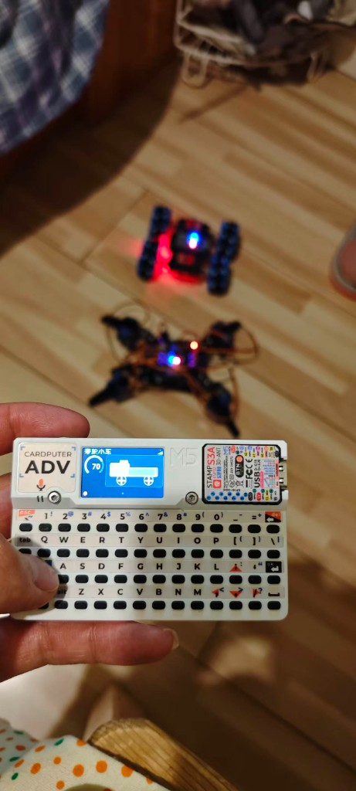
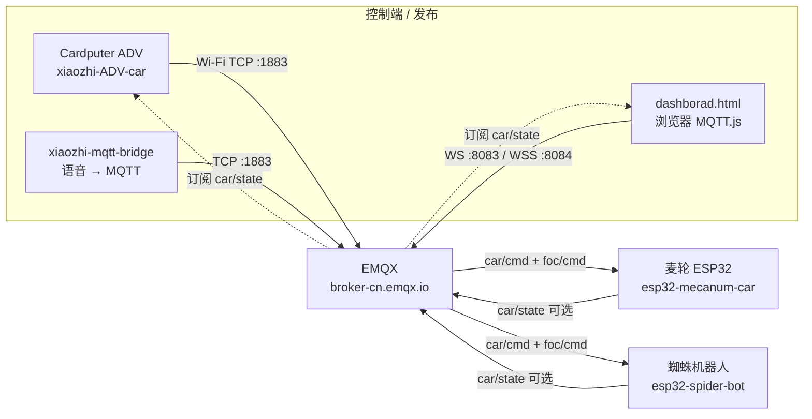

# ESP32 小车 MQTT 控制协议（xiaozhi-ADV-car）

本文说明 **Cardputer ADV 车控 fork** 与麦轮 / 蜘蛛机器人之间的 EMQX 通信协议，与小智云端 MQTT/WebSocket 语音通道相互独立。

依据与对照：

- 工作区总览：`~/Documents/esp/mqtt_io.md`
- 麦轮设备端：`~/Documents/esp/car/esp32/io.md`、`car/esp32/dashborad.html`
- 本板配置：`main/boards/m5stack-cardputer-adv-car/emqx_config.h`、车控页按键映射

---

## 概述



Cardputer ADV（板型 `m5stack-cardputer-adv-car`）连上 Wi-Fi 后，额外连接公共 EMQX Broker，向 `car/cmd` / `foc/cmd` 发布 JSON 指令；麦轮小车（`car/esp32`）与蜘蛛机器人（`spider-bot/arduino`）订阅同一套 topic 并执行运动。可选订阅 `car/state` 做仪表盘反馈。

同一 Broker、同一 topic 下，**麦轮与蜘蛛协议相同**（Client ID 不同）。任意发布端（本机键盘、网页仪表盘、`xiaozhi-mqtt-bridge`）发出的 `car/cmd` `run`/`speed`，两台设备都可能同时响应。

---

## 架构图



数据流（简图）：

```
Cardputer ADV (xiaozhi-ADV-car)
  → WiFi
  → EMQX broker
  → car/cmd + foc/cmd
  → esp32 麦轮小车 / spider-bot
  ← car/state（可选）

其他发布端：dashborad.html / xiaozhi-mqtt-bridge
```

---

## Broker 与客户端

| 项目 | 值 |
|------|-----|
| Host | `broker-cn.emqx.io` |
| 设备 TCP | `1883`（Cardputer / 麦轮 / 蜘蛛） |
| 浏览器 WebSocket | `ws://broker-cn.emqx.io:8083/mqtt` |
| 浏览器 WSS | `wss://broker-cn.emqx.io:8084/mqtt`（WS 失败时仪表盘可回退） |
| 默认速度 | `30`（`EMQX_DEFAULT_SPEED`） |
| 发布 QoS | `1` |

| 角色 | Client ID（示例） |
|------|-------------------|
| Cardputer ADV | `xiaozhi-adv-car-<MAC末两字节>` |
| 麦轮 `car/esp32` | `esp32-mecanum-car` |
| 蜘蛛 `spider-bot` | `esp32-spider-bot` |
| 网页仪表盘 | `WebDash_<随机>` |

本板常量见 `emqx_config.h`：`EMQX_TOPIC_CAR_CMD` / `FOC_CMD` / `CAR_STATE`。

**与小智云 MQTT 的关系**：语音聊天走官方/自建小智协议（见 `docs/mqtt-udp_zh.md`、`docs/websocket_zh.md`）。车控 EMQX 通道仅用于 `car/*`、`foc/cmd`，互不共用认证与 topic。

---

## Topic 与 JSON 协议表

### `car/cmd`（启停 / 速度）

控制端 → 设备。**不解析 `dir`**（转向走 `foc/cmd`）。

```json
{"run":1,"speed":70}
```

| 字段 | 类型 | 范围 | 说明 |
|------|------|------|------|
| `run` | int | `0` / `1` | `1` 前进运行，`0` 停止 |
| `speed` | int | `0`-`100` | 目标速度百分比 |
| `command` | string | 可选 | 部分固件支持 `forward` / `home` / `turn_L` 等；Cardputer 本板只发 `run`+`speed` |

本板发布示例（`EmqxCarMqtt::PublishCarCmd`）：

| 操作 | JSON |
|------|------|
| 前进 | `{"run":1,"speed":30}` |
| 停止 | `{"run":0,"speed":30}` |

### `foc/cmd`（转向）

边沿触发转弯（设备端约 `TURN_BURST_MS`，如 800ms）。`dir` 约定与工作区一致：

```json
{"dir":1,"speed":70}
```

| 字段 | 类型 | 范围 | 说明 |
|------|------|------|------|
| `dir` | int | `1` / `-1` / `0` | **`1` = 左转**，**`-1` = 右转** |
| `speed` | int | `0`-`100` | 转弯速度 |
| `run` | int | `0` / `1` | 可选；`0` 可作停转 |

本板发布示例（`PublishFocCmd`）：

| 操作 | JSON |
|------|------|
| 左转 | `{"dir":1,"speed":30}` |
| 右转 | `{"dir":-1,"speed":30}` |

### `car/state`（状态反馈，可选订阅）

设备 → 控制端，约每 1s 发布：

```json
{"run":1,"speed":70,"pwm":191}
```

| 字段 | 类型 | 说明 |
|------|------|------|
| `run` | int | `0` 停 / `1` 运行 |
| `speed` | int | 目标速度 0-100 |
| `pwm` | int | 实际 PWM（麦轮多为 0-255） |

Cardputer 连接成功后订阅 `car/state`，用于车控页仪表盘（无文字时可用信号塔等表示 MQTT 状态）。

---

## 控制端映射

### Cardputer ADV 按键（本 fork）

| 按键 | 动作 | Topic / Payload |
|------|------|-----------------|
| **Fn+1** | 聊天页 | （不发车控 MQTT） |
| **Fn+2** | 麦轮页 | （切页；控车键见下） |
| **Fn+3** | 蜘蛛页 | （切页；控车键见下） |
| **`;`** / 上 | 前进 | `car/cmd` `{"run":1,"speed":...}` |
| **`.`** / 下 | 停止 | `car/cmd` `{"run":0,"speed":...}` |
| **`,`** / 左 | 左转 | `foc/cmd` `{"dir":1,"speed":...}` |
| **`/`** / 右 | 右转 | `foc/cmd` `{"dir":-1,"speed":...}` |

说明：

- 车控键在麦轮 / 蜘蛛页生效，**无需按 Fn**；Fn 仅用于 Fn+1/2/3 切页。
- Fn 为键盘左下独立键（`KEY_MOD_FN`），不是 Opt。
- 麦轮页与蜘蛛页发布 **同一套 topic**；切页不切换 Broker/topic。

### 网页仪表盘 `car/esp32/dashborad.html`

| UI | Topic | Payload 要点 |
|----|-------|----------------|
| START | `car/cmd` | `{"run":1,"speed":...}` |
| STOP | `car/cmd` | `{"run":0,"speed":...}` |
| 速度滑块（运行中） | `car/cmd` | `{"run":1,"speed":...}` |
| 左转 | `foc/cmd` | `{"dir":1,"speed":...}` |
| 右转 | `foc/cmd` | `{"dir":-1,"speed":...}` |
| 状态显示 | 订阅 `car/state` | `run` / `speed` / `pwm` |

浏览器默认 `ws://broker-cn.emqx.io:8083/mqtt`，失败时可试 `wss://broker-cn.emqx.io:8084/mqtt`。

### 其他发布端

- `head-tracker/xiaozhi-mqtt-bridge`：语音/MCP → `car/cmd` 的 `run`/`speed`（FOC 转向仍用 `foc/cmd`）。
- 命令行：`mosquitto_pub -h broker-cn.emqx.io -t car/cmd -m '{"run":1,"speed":70}'`

---

## 设备端订阅发布

| 设备 | 工程路径 | Client ID | 订阅 | 发布 |
|------|----------|-----------|------|------|
| 麦轮 V4 | `~/Documents/esp/car/esp32` | `esp32-mecanum-car` | `car/cmd`、`foc/cmd` | `car/state` |
| 蜘蛛 | `~/Documents/esp/spider-bot/arduino` | `esp32-spider-bot` | `car/cmd`、`foc/cmd` | `car/state` |

行为摘要：

- `car/cmd`：解析 `run` / `speed`（及可选 `command`）；**忽略 `dir`**。
- `foc/cmd`：按 `dir` 短时转弯。
- 单线程 `mqtt.loop()` + 命令队列（避免 WDT），详见 `car/esp32/io.md`。

---

## 注意事项

1. **同 Broker 双设备**：麦轮与蜘蛛共用 `car/cmd` / `foc/cmd`，一条 `run`/`speed` 可能两台一起动。调试时只上电一台，或改用独立 topic/Broker。
2. **与小智云 MQTT 独立**：车控 EMQX 不替代语音链路；断网时聊天与车控可能分别失败。
3. **OTA 板名**：本 fork 为 `m5stack-cardputer-adv-car`，勿与官方 `m5stack-cardputer-adv` 混用，以免 OTA 覆盖。
4. **方向约定**：`dir=1` 左、`dir=-1` 右，与 `mqtt_io.md`、仪表盘、`VehicleControlPage` 一致；勿与「正数为右」的习惯搞反。
5. **UTF-8**：编辑中文文档/HTML 时保持 UTF-8，避免出现 `?` 替换乱码。

---

## 相关链接

- 板型说明：[`main/boards/m5stack-cardputer-adv-car/README_zh.md`](../main/boards/m5stack-cardputer-adv-car/README_zh.md)
- 工作区协议总览：`~/Documents/esp/mqtt_io.md`
- 麦轮 I/O：`~/Documents/esp/car/esp32/io.md`
- 小智云 MQTT+UDP（非车控）：[`mqtt-udp_zh.md`](mqtt-udp_zh.md)
