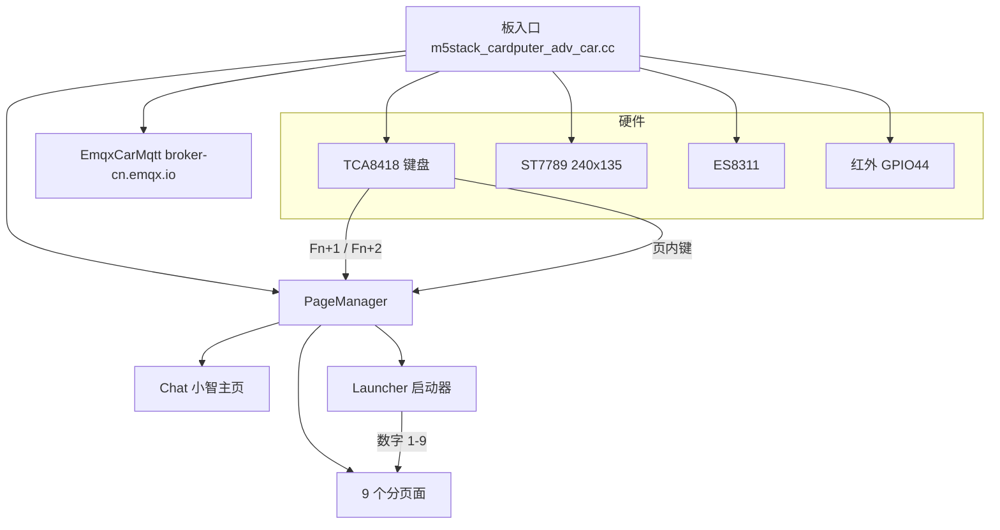

# M5Stack Cardputer Adv Car（xiaozhi-ADV-car Fork）

本目录为 **xiaozhi-ADV-car** 专用板型，OTA 板名：`m5stack-cardputer-adv-car`。

**板级文档**（架构、每页操作、加图/内存坑）：[docs/README.md](docs/README.md)

## 架构规划

开机进 **Chat**。板入口挂上键盘 / 屏 / 音频 / 红外后，交给 `PageManager` 管页面：聊天 UI 只隐藏不销毁；其余独占页按需建、离页拆，给无 PSRAM 腾堆。分层细节、切页内存见 [docs/architecture.md](docs/architecture.md)。



切页（任意页都有效；分页面只能从启动器进，没有 Fn+3 直切）：


| 入口 | 页面 | 做什么 |
|------|------|--------|
| 开机 / **Fn+1** | Chat | 小智语音聊天 |
| **Fn+2** | 启动器 | 3×3 菜单，数字 1–9 进分页面 |
| 启动器 **1** | Car | MQTT 麦轮 |
| **2** | Spider | MQTT 蜘蛛 |
| **3** | IceBox | 红外空调 |
| **4** | Clock | 像素时钟 |
| **5** | Rain | Matrix 字幕 |
| **6** | Music | 麦拾音柱 |
| **7** | Radio | 网络电台 |
| **8** | Snake | 贪吃蛇 |
| **9** | Dino | 小恐龙跑酷 |

每页画面、按键、进出页行为：[docs/pages.md](docs/pages.md)。加图须编译期 RGB565，禁止运行时解 PNG：[docs/images.md](docs/images.md)。

## 目录结构

```
m5stack-cardputer-adv-car/
  m5stack_cardputer_adv_car.cc   # 板级入口
  config.h / config.json         # 引脚与 sdkconfig 追加
  tca8418_keyboard.*             # 键盘
  wifi_config_ui.*               # WiFi 配置 UI
  common/                        # 页面框架、MQTT、车控基类、LCD 封装
    page.h / page_id.h / page_manager.*
    vehicle_control_page.* / emqx_* / car_state.h
    cardputer_adv_lcd_display.*
  pages/
    launcher/                    # Fn+2 启动器（顶栏中央时间）
    car/                         # 麦轮小车
    spider/                      # SpiderBot
    icebox/                      # 三菱空调 MJ（mj_ac_page）
    clock/                       # 像素时钟
    matrix/                      # Rain 字幕下落（淡出拖尾）
    cursor/                      # Music 拾音柱状图（文件名仍为 cursor）
    radio/                       # 央广 CNR1 WiFi 直播
    snake/                       # 贪吃蛇（16x9 全屏格子，无 canvas）
    dino/                        # 小恐龙跑酷
  ir/                            # 板载红外（GPIO44），与 pages/icebox 配合
  docs/                          # 架构 / 页面操作 / 图片内存
```

## 与官方 ADV 的区别

- 基于 `m5stack-cardputer-adv` 拷贝，独立 OTA 名称，可与官方固件并存升级
- **切页（按住 Fn）**

  | 组合 | 页面 |
  |------|------|
  | **Fn+1** | 聊天（小智） |
  | **Fn+2** | 启动器（Sparks 风格菜单，logo **点阵镂空 M + YJ**） |

  Car / SpiderBot / IceBox 等仅从启动器数字键进入（见下表），**无** Fn+3/4/5 直切。

- 启动器（ASCII 标签，避免中文乱码）按数字进入；顶栏中央显示系统时间（HH:MM:SS，SNTP）：

  | 键 | 标签 | 页面 |
  |----|------|------|
  | **1** | Car | 麦轮小车 |
  | **2** | SpiderBot | 蜘蛛 |
  | **3** | IceBox | 三菱空调 |
  | **4** | Clock | 像素时钟（系统时间 / SNTP） |
  | **5** | Rain | Matrix 字幕下落（淡出拖尾） |
  | **6** | Music | 拾音器柱状图（ES8311 mic；原 Cursor） |
  | **7** | Radio | 央广 CNR1 中国之声（HLS/TS AAC → ES8311） |
  | **8** | Snake | 贪吃蛇（`;`上 `.`下 `,`左 `/`右 或 WASD；Enter 开始/重开；P 暂停） |
  | **9** | Dino | 小恐龙跑酷（空格/Enter/W/↑ 跳跃；P 暂停；随分数加速） |

  Dino 页画面示意：

  ```
  DINO 123      00:45        SPD 5.6
  (分数·左)   (计时·顶中)  (速度·右)
                        ✧ (☀) ✧      ← 太阳+光芒，缓慢漂浮
                     ⌣⌣⌣             ← 海鸥简笔画，5~15s 飞过一只，1.6x 树速
            ▲
           / \        ← 杉树（绿三角+棕树干，随分数加速滚来）
      ═══════════════════
        🦖 (腿蹬地)      ← 空格/↑ 跳跃
  ```

  - 左上：分数；顶中：计时 MM:SS（开跑开始计，暂停/死亡冻结）；右上：SPD 速度
  - 音效：跳跃"嘀"、撞树"哔—呜"、C 大调琶音 BGM（Running 时循环）
- 车控页：**;** 前进、**.** 停止、**,** 左转、**/** 右转（无需 Fn）
- IceBox 空调页：针对 **三菱电机 ZFJ 系列 MSZ-ZFJ12VA（KFR-36GW/BpU / ZFJ12）**
  - **P** 电源、**M** 模式、**F** 风速、**;**/**.** 温度 — 每次按键立即改 UI 并发红外（无需 Enter）
  - **S** 强制重发；协议默认 **`MITSUBISHI_AC`**（GPIO 44），见 `ir/mitsubishi_ir.h` 的 `MJ_AC_IR_PROTOCOL`
- Broker：`broker-cn.emqx.io:1883`，订阅 `car/state` 显示运行状态
- **Fn** 为键盘左下独立键（row2 col0，`KEY_MOD_FN`），**不是** Opt 键
- 切页使用 `lv_obj HIDDEN` 隐藏聊天 UI，不销毁 LVGL 树

## MQTT 车控

本板通过独立 EMQX 通道控制麦轮 / 蜘蛛（与小智云 MQTT 无关）：

| Topic | 作用 |
|-------|------|
| `car/cmd` | `{"run":0\|1,"speed":0-100}`（无 `dir`） |
| `foc/cmd` | 转向 `{"dir":1\|-1,"speed":…}`（`1` 左 / `-1` 右） |
| `car/state` | 反馈 `{"run","speed","pwm"}`（本板订阅） |

完整协议、架构图与网页仪表盘映射见项目文档：**[docs/mqtt/car-mqtt-control.md](../../../docs/mqtt/car-mqtt-control.md)**。

## 硬件

与 M5Stack Cardputer Adv 相同：ESP32-S3、8MB Flash、无 PSRAM、ST7789 240×135、TCA8418 键盘、**板载红外发射 GPIO 44**（与 Sparks 固件一致；红外光人眼不可见，看左上角粉色 TX 点）。

空调红外代码已放在本板目录：

```
main/boards/m5stack-cardputer-adv-car/ir/
  mitsubishi_ir.cc / .h     # ZFJ12 封装，默认 MITSUBISHI_AC，发送两遍
  arduino_shim/             # Arduino API 薄封装（仅本板 IR 用）
  IRremoteESP8266/          # 精简依赖的 IRremoteESP8266 源码树（v2.8.6）
  ir_utils_stub.cpp
```

若 `ir/IRremoteESP8266` 目录为空，可重新拉取：

```bash
git clone --depth 1 --branch v2.8.6 \
  https://github.com/crankyoldgit/IRremoteESP8266.git \
  main/boards/m5stack-cardputer-adv-car/ir/IRremoteESP8266
```

## 构建

**预编译固件（v2.2.7）**：见 [firmware/m5stack-cardputer-adv-car/RELEASE_v2.2.7.md](firmware/m5stack-cardputer-adv-car/RELEASE_v2.2.7.md)（烧录说明 + 按键用法）。GitHub Release：[v2.2.7](https://github.com/hengmyj/xiaozhi-adv-car/releases/tag/v2.2.7)

- `xiaozhi-adv-car-v2.2.7.bin` — 整包，从 `0x0` 烧录

```bash
python -m esptool --chip esp32s3 -b 460800 -p PORT \
  --before default_reset --after hard_reset \
  write_flash --flash_mode dio --flash_size 8MB --flash_freq 80m \
  0x0 firmware/m5stack-cardputer-adv-car/xiaozhi-adv-car-v2.2.7.bin
```

**ESP-IDF 版本**：与上游 xiaozhi-esp32 2.2.x 相同，需 **5.4 或以上**（本机已验证 **v5.5.3**）。

```bash
# 推荐 IDF（勿用 ~/Documents/esp/esp-idf 的旧 v5.0-dev）
export IDF_PATH=~/.espressif/v5.5.3/esp-idf
. "$IDF_PATH/export.sh"
# 若提示 Python 虚拟环境不存在：
# $IDF_PATH/tools/idf_tools.py install-python-env

cd ~/Documents/esp/xiaozhi-ADV-car
```

### 一键脚本（推荐）

在项目根目录：

```bash
./flash.sh              # 编译 + 烧录（不自动开监视器）
./monitor.sh            # 仅串口监视
PORT=/dev/cu.usbmodem101 ./flash.sh
```

`flash.sh` 会自动 `set-target esp32s3` 并写入本板 `sdkconfig`：`CONFIG_BOARD_TYPE_M5STACK_CARDPUTER_ADV_CAR=y`、`CONFIG_SPIRAM=n`、`CONFIG_ESPTOOLPY_FLASHSIZE_8MB=y`、分区表 `partitions/v2/8m_adv_car.csv`（OTA 略放大以容纳 AAC 收音机；assets 1.5MB）、以及精简 `esp_audio_codec`（仅 AAC/TS）。

**注意**：分区偏移相对旧 `8m.csv` 有变，首次刷机请整包 flash（含 partition table / assets），不能仅 OTA 升级。

### 官方 release 脚本

```bash
python3 scripts/release.py m5stack-cardputer-adv-car --name m5stack-cardputer-adv-car
```

### 手动 idf.py

```bash
idf.py set-target esp32s3
# 在 sdkconfig 末尾追加 config.json 中的 sdkconfig_append，或 menuconfig 选择本板型
idf.py -DBOARD_NAME=m5stack-cardputer-adv-car -DBOARD_TYPE=m5stack-cardputer-adv-car build
idf.py -p PORT flash
idf.py -p PORT monitor
```

## 上游

Fork 自 [78/xiaozhi-esp32](https://github.com/78/xiaozhi-esp32)，车控代码仅在本 board 目录。
