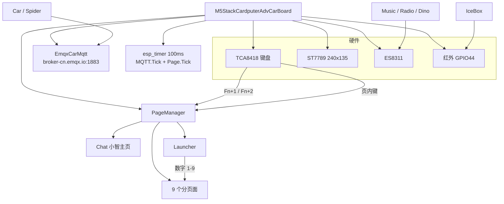
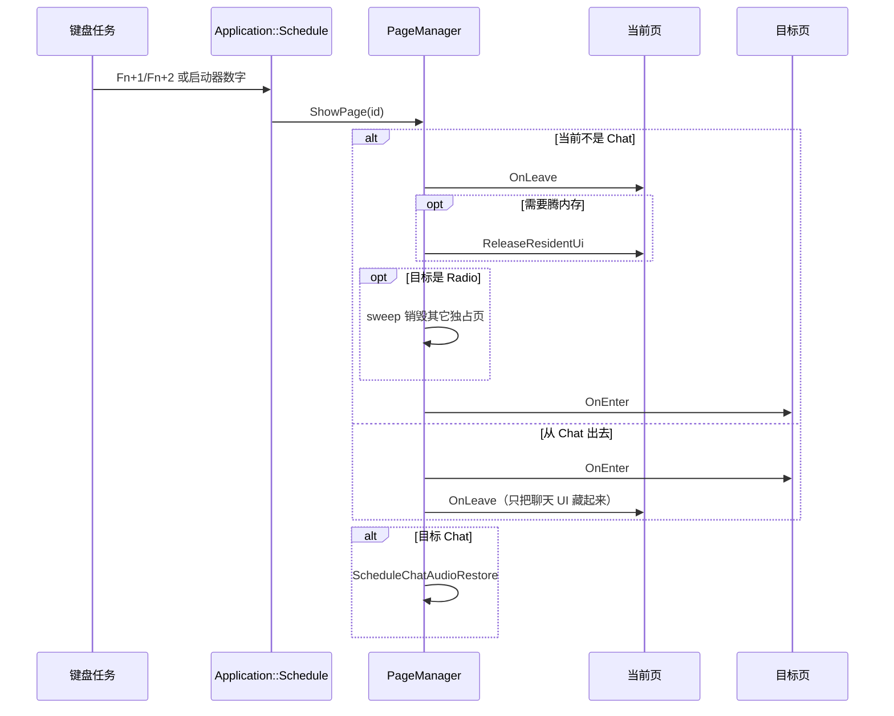

# 项目架构

板型目录：`main/boards/m5stack-cardputer-adv-car/`。这是 xiaozhi-esp32 的独立板拷贝，OTA 名 `m5stack-cardputer-adv-car`，可与官方 ADV 固件并存。

## 1. 目录

```
m5stack-cardputer-adv-car/
  m5stack_cardputer_adv_car.cc   板级入口：I2C/SPI/LCD/键盘/定时器
  config.h / config.json         引脚、sdkconfig 追加（无 PSRAM、8MB、MP3/AAC）
  tca8418_keyboard.*             56 键矩阵
  wifi_config_ui.*               机上扫网 + 输密码配网
  common/
    page.h / page_id.h / page_manager.*
    vehicle_control_page.*       麦轮 / 蜘蛛共用仪表盘
    emqx_* / car_state.h         独立 EMQX 通道（与小智云 MQTT 无关）
    cardputer_adv_lcd_display.*  隐藏/显示聊天 UI
    kid_face_icon.h              Dino logo：120×90 RGB565，放 .rodata
  pages/
    launcher/                    Fn+2 启动器
    car/                         1 麦轮小车
    spider/                      2 SpiderBot
    icebox/                      3 三菱空调（mj_ac_page）
    clock/                       4 像素时钟
    matrix/                      5 Rain 字幕下落
    cursor/                      6 Music 拾音柱（文件名仍是 cursor）
    radio/                       7 网络电台
    snake/                       8 贪吃蛇
    dino/                        9 小恐龙
  ir/                            GPIO44 红外，配合 IceBox
  docs/                          本目录
```

## 2. 运行时分层



启动顺序：

1. 板构造函数：I2C 扫描 → SPI → ST7789 → BOOT 键 → TCA8418。
2. `SetupUI` 回调里：初始化 EMQX、`PageManager::Initialize`（只 `ShowChatUi`，不重建 Opus）、启动 100ms 定时器。
3. 开机默认 **Chat**。`AudioService` 此时还没把 codec 挂上，所以初始化阶段禁止走 Chat `OnEnter` / `RestoreAudioModels`。

## 3. 页面模型

所有分页面实现 `Page`：

| 接口 | 作用 |
|------|------|
| `OnEnter` | 建/复用 panel，放到前景，`HideChatUi()` |
| `OnLeave` | 停业务（IR / 麦 / 电台 / 游戏 BGM），隐藏或销毁 panel |
| `GetRootPanel` | 独占页返回根 panel；Chat 返回 `nullptr`（用小智自己的 UI） |
| `ReleaseResidentUi` | `lv_obj_del` 丢掉隐藏的独占 UI，把内部 SRAM 连续块让出来 |
| `Tick` | 100ms 定时器驱动动画 / HUD / 流状态 |
| `HandleKey` | 页内按键（Fn 已在板入口拦截） |

`PageId`（`common/page_id.h`）：

| Id | 枚举 | 页面 |
|----|------|------|
| 1 | Chat | 小智 |
| 2 | Car | 麦轮 |
| 3 | Spider | 蜘蛛 |
| 4 | MjAc | IceBox 空调 |
| 5 | Launcher | 启动器 |
| 6 | Clock | 时钟 |
| 7 | Matrix | Rain |
| 8 | Music | 拾音柱（实现类仍叫 `CursorPage`） |
| 9 | Radio | 电台 |
| 10 | Snake | 贪吃蛇 |
| 11 | Dino | 小恐龙 |

Chat 不是独占页：它复用上游 `SpiLcdDisplay` 的表情/状态栏。其余都是独占页——全屏盖住聊天 UI。

切页由 `PageManager::ShowPage` 完成，从键盘任务 `Application::Schedule` 到主循环，避免在键盘 ISR/任务里做 LVGL 和红外。



切页失败（新 panel 没出来、Chat UI 仍隐藏）会 `RecoverToChat`；独占页 Tick 时若 panel 丢了，同样拉回 Chat。

## 4. 输入路由

`HandlePageSwitchKey` 只认 **按住 Fn + 1/2**。Fn 是键盘左下独立键（row2 col0，`KEY_MOD_FN`），不是 Opt。

之后：

- 独占页：所有非 Fn 键交给当前页 `HandleKey`，**配网 UI 抢不到**数字 / P/M/F。
- Chat 页：方向键调音量/亮度，Enter 切换聆听；配网模式下 W 扫网、S 已存列表。
- Car / Spider 另有一套 legacy 方向键映射到 `;` `.` `,` `/`。

Cardputer 方向习惯（多页共用）：

| 键 | 含义 |
|----|------|
| **;** / ↑ | 上 / 前进 / 升温 / 音量+ |
| **.** / ↓ | 下 / 停止 / 降温 / 音量- |
| **,** / ← | 左 |
| **/** / → | 右 |

## 5. 进出页与内存（会不会切几次就重启）

本板内部 SRAM 大约空闲 40KB 量级，最大连续块常只有十几 KB。LVGL 对象、MP3 解码器、HTTP 缓冲都挤在这里。**隐藏不等于释放**：`LV_OBJ_FLAG_HIDDEN` 的 panel 仍占堆。

| 离开谁 | OnLeave 做什么 | 什么时候 Destroy |
|--------|----------------|------------------|
| Chat | 不拆小智 UI | 从不拆，只 Hide/Show |
| Launcher | 隐藏 panel（约 46 个对象 / 10KB） | 进 Snake/Dino 时释放；进 Radio 时被 sweep |
| Car / Spider / IceBox | 隐藏仪表盘；IceBox 先 `ir_.Cancel()` | 离开仪表盘组（去 Chat/启动器/游戏/电台）时 Destroy；**三者互切保留**（IceBox→Car 曾经 Destroy 会卡死 LVGL） |
| Clock / Matrix | 立刻 DestroyPanel | canvas 像素在 BSS，Destroy 只丢 LVGL 对象 |
| Music | 等麦采集结束 → 关麦 → 释放 `mic_buf_` → Destroy 24 根柱 | 每次离开都 Destroy |
| Radio | 作废 `enter_gen_` → StopStream → DestroyPanel | 每次离开都 Destroy；**不**在 OnLeave 里重建 Opus |
| Snake / Dino | 停逻辑；Dino 再停 BGM 任务 → Destroy | 每次离开都 Destroy |

进 **Radio** 前会 `ReleaseOtherExclusiveUi`：把其它独占页（含启动器）全部 Destroy，只留 Chat + Radio，给 Helix MP3（约 16–20KB 连续块）腾坑。

回 Chat 时 `ScheduleChatAudioRestore`：等 `ShowPage` 结束、`switching_` 已清，且曾经 `ReleaseAudioModels` 才 `RecycleDevice` 重建 Opus。开机第一次进 Chat 跳过（codec 还是空的）。

结论：**按现在的 OnLeave / ReleaseResidentUi，来回切页会把独占 UI 拆掉，不会无限堆对象。** 仍要避免的是：运行时解 PNG（ARGB8888 要约 19KB 连续堆）、隐藏着一堆仪表盘再开电台、在 `esp_timer` Tick 里 close codec。

软看门狗：独占页 Tick 发现 panel 丢失 → `RecoverToChat`。

## 6. 音频与 MQTT

- Chat：Opus 编解码 + 唤醒/语音（本板 `CONFIG_WAKE_WORD_DISABLED=y`，没有 AFE）。
- Music：独占麦克风，关掉唤醒/语音处理，读 ES8311 PCM 画柱。
- Radio：`ReleaseAudioModels()` 丢掉约 43KB Opus，HTTP 拉 64kbps MP3，重采样 44100→24000 后直写 codec。流任务 **core 0 / 优先级 3**（LVGL 在 core1/prio1，抢了会 `task_wdt`）。
- Dino：短 Beep + C 大调琶音任务，离开即停。
- 回 Chat：见上一节 `ScheduleChatAudioRestore`。

MQTT（仅 Car / Spider）：

| Topic | 方向 | 载荷 |
|-------|------|------|
| `car/cmd` | 本板 → 车 | `{"run":0\|1,"speed":0-100}` |
| `foc/cmd` | 本板 → 转向 | `{"dir":1\|-1,"speed":…}`（1 左 / -1 右） |
| `car/state` | 车 → 本板 | `{"run","speed","pwm"}` |

Broker：`broker-cn.emqx.io:1883`。切回 Chat 时若车还在跑，会发一次 `run=0`。协议细节见仓库 [docs/mqtt/car-mqtt-control.md](../../../../docs/mqtt/car-mqtt-control.md)。

## 7. 显示

`CardputerAdvCarLcdDisplay` 在进独占页时 `HideChatUi()`：把 `container_` / `status_bar_` / `top_bar_` / `emoji_box_` 一起藏掉。只藏 `container_` 会留下一个漂着的 WiFi 图标。Chat 的 `OnEnter` 再 `ShowChatUi()`。

LVGL 9.5、色深 16。文件系统驱动没开，不能从 SPIFFS 直接读 PNG。
